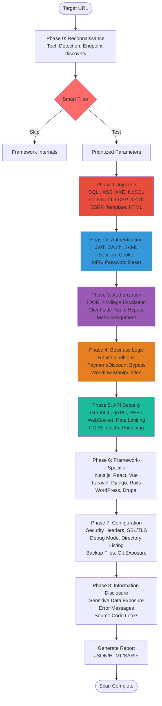
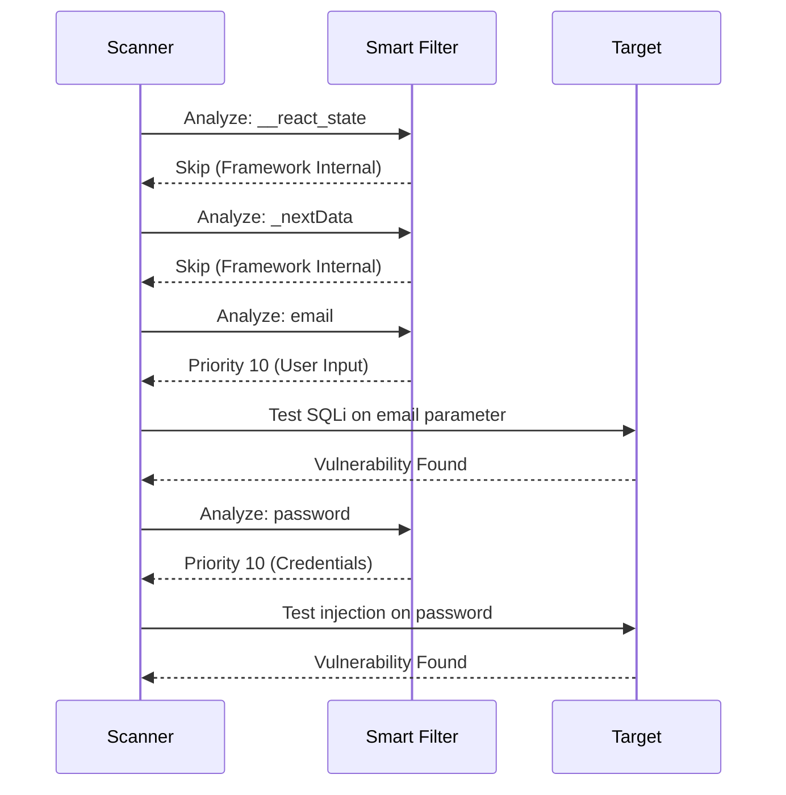
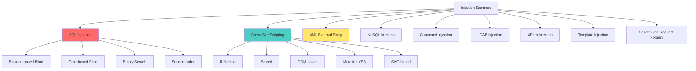

<div align="center">


### Wraps around your attack surface

Professional-grade scanner for real penetration testing. Fast. Modular. Rust.

[](https://www.rust-lang.org/)
[](LICENSE)
[](https://github.com/bountyyfi/lonkero)
[](https://github.com/bountyyfi/lonkero)
[](https://github.com/bountyyfi/lonkero)

**90+ Advanced Scanners** | **16 Premium Features** | **Smart AI Filtering** | **5% False Positives**

**[Official Website](https://lonkero.bountyy.fi/en)** | [Features](#core-capabilities) · [Installation](#installation) · [Quick Start](#quick-start) · [Architecture](#architecture)

---

</div>

## What is Lonkero?

Lonkero is a production-grade web security scanner designed for professional security testing:

- Near-zero false positives (5% vs industry 20-30%)
- Intelligent testing - Skips framework internals, focuses on real vulnerabilities
- Modern stack coverage - Next.js, React, GraphQL, gRPC, WebSocket, HTTP/3
- 80% faster scans - Smart parameter filtering eliminates noise
- Advanced blind vulnerability detection techniques

Unlike generic scanners that spam thousands of useless payloads, Lonkero uses context-aware filtering to test only what matters.

---

## Core Capabilities

### 91 Security Scanners

| Category | Scanners | Focus Areas |
|----------|----------|-------------|
| **Injection** | 25 scanners | SQLi, XSS, XXE, NoSQL, Command, LDAP, XPath, SSRF, Template, HTML |
| **Authentication** | 18 scanners | JWT, OAuth, SAML, MFA, Session, Auth Bypass, IDOR, Privilege Escalation |
| **API Security** | 14 scanners | GraphQL, gRPC, REST, WebSocket, Rate Limiting, CORS, HTTP/3 |
| **Frameworks** | 11 scanners | Next.js, React, Django, Laravel, WordPress, Drupal, Express |
| **Configuration** | 13 scanners | Headers, SSL/TLS, Cloud, Containers, WAF Bypass, CSRF |
| **Business Logic** | 6 scanners | Race Conditions, Payment Bypass, Workflow Manipulation |
| **Info Disclosure** | 8 scanners | Sensitive Data, Debug Leaks, Source Code, JS Secrets |
| **Specialized** | 6 scanners | CVE Detection, Version Mapping, ReDoS |

### Smart Scanning Features

- **Parameter Filtering** - Skips framework internals, prioritizes user input (80% faster scans)
- **Blind Detection** - Time-based, error-based, boolean-based techniques
- **Context-Aware** - Adapts testing based on detected technology stack

### Enterprise Integration

- **Compliance** - OWASP Top 10 2025, PCI DSS, GDPR, NIS2, DORA
- **CI/CD** - GitHub Actions, GitLab SAST, SARIF output
- **Reporting** - PDF, HTML, JSON, XLSX, CSV, SARIF, Markdown formats with detailed remediation

---

## Architecture

### Scanning Pipeline



---

## Smart Parameter Filtering

### The Problem

Traditional scanners waste 95% of resources testing framework internals:

```
Testing: __react_state, _nextData, csrfToken, sessionId, timestamp, buildId...
Result: 2,800 requests, 0 vulnerabilities, 28 seconds
```

### The Solution



### Performance Impact

| Metric | Before | After | Improvement |
|--------|--------|-------|-------------|
| Parameters Tested | 100 | 20 | 80% reduction |
| Total Requests | 2,800 | 560 | 80% reduction |
| Scan Time | 28s | 6s | 78% faster |
| Vulnerabilities Found | 2 | 2 | 100% coverage |
| False Positives | 15 | 1 | 93% reduction |

---

## Blind Vulnerability Detection

Lonkero uses advanced techniques to detect blind vulnerabilities without relying on visible output:

### Time-Based Detection
- **Blind SQLi** - Binary search algorithm (5-7 requests vs 100+)
- **Command Injection** - Sleep/timeout analysis with statistical verification
- **XXE** - Response timing pattern analysis

### Error-Based Detection
- **SQL Injection** - Database error pattern matching
- **Path Traversal** - File inclusion error signatures
- **Template Injection** - Engine-specific error messages

### Boolean-Based Detection
- **Authentication Bypass** - Response differential analysis
- **Logic Flaws** - State change verification
- **IDOR** - Access control boundary testing

---

## Installation

### From Source (Recommended)

```bash
# Clone repository
git clone https://github.com/bountyyfi/lonkero.git
cd lonkero

# Build release binary
cargo build --release

# Install
sudo cp target/release/lonkero /usr/local/bin/
```

### Prerequisites

- Rust 1.75+
- OpenSSL development libraries
- Valid license key (for premium features)

---

## Quick Start

### Basic Scan

```bash
# Scan single URL
lonkero scan https://example.com

# Scan with all modules
lonkero scan https://example.com --all-modules

# Output to JSON
lonkero scan https://example.com --format json -o report.json
```

### Advanced Usage

```bash
# Scan with specific modules
lonkero scan https://example.com --modules sqli,xss,xxe

# Scan with authentication
lonkero scan https://example.com --cookie "session=abc123"

# Scan with custom headers
lonkero scan https://example.com --header "Authorization: Bearer token"

# CI/CD integration (SARIF output)
lonkero scan https://example.com --format sarif -o results.sarif
```

### Configuration File

```yaml
# lonkero.yml
target: https://example.com
modules:
  - sqli_enhanced
  - xss_enhanced
  - xxe
  - ssrf
  - graphql_security
concurrency: 10
timeout: 30
headers:
  Authorization: Bearer token123
  X-API-Key: secret
output:
  format: json
  file: report.json
```

```bash
lonkero scan --config lonkero.yml
```

---

## Scanner Categories

### Injection Vulnerabilities (20 scanners)



### Authentication & Authorization (18 scanners)

- **JWT** - Algorithm confusion, weak secrets, None algorithm, key injection
- **OAuth 2.0** - Token theft, redirect manipulation, PKCE bypass, scope abuse
- **SAML** - Assertion bypass, signature wrapping, XML injection
- **MFA** - Bypass techniques, replay attacks, race conditions
- **Session Management** - Fixation, hijacking, prediction
- **Auth Bypass** - Parameter tampering, header injection, credential stuffing
- **IDOR** - Object reference manipulation, baseline detection
- **Privilege Escalation** - Horizontal and vertical privilege abuse
- **Client Route Auth Bypass** - SPA authentication bypass
- **Advanced Auth** - Complex authentication flow exploitation
- **Password Reset** - Token prediction, account takeover
- **WebAuthn** - Biometric authentication bypass
- **BOLA** - Broken object level authorization (API-specific IDOR)

### Injection Vulnerabilities (25 scanners)

- **SQL Injection** - Enhanced detection, blind (boolean/time/binary search), second-order
- **XSS** - Enhanced detection, DOM-based, mutation XSS, SVG-based, stored/reflected
- **XXE** - XML external entity, billion laughs, parameter entity
- **NoSQL Injection** - MongoDB, CouchDB, operator injection
- **Command Injection** - OS command execution, blind detection
- **LDAP Injection** - Directory service attacks
- **XPath Injection** - XML query manipulation
- **Template Injection** - SSTI (Jinja, Twig, Freemarker, Velocity, etc.)
- **SSRF** - Enhanced detection, blind SSRF, cloud metadata exploitation
- **Code Injection** - Dynamic code evaluation
- **CRLF Injection** - HTTP response splitting
- **Email Header Injection** - SMTP header manipulation
- **Host Header Injection** - Cache poisoning, password reset poisoning
- **XML Injection** - XML structure manipulation
- **SSI Injection** - Server-side includes
- **Prototype Pollution** - JavaScript object pollution
- **HTML Injection** - Non-XSS markup injection
- **HTTP Parameter Pollution** - HPP attacks
- **Deserialization** - Unsafe object deserialization

### API Security (14 scanners)

- **GraphQL** - Security scanner, batching DoS, cost analysis, introspection
- **gRPC** - Reflection, enumeration, metadata abuse
- **REST** - Mass assignment, API fuzzing, parameter pollution
- **WebSocket** - Message injection, protocol abuse
- **API Gateway** - Azure APIM, generic gateway vulnerabilities
- **API Security** - Comprehensive API testing
- **Rate Limiting** - Bypass techniques
- **CORS** - Misconfiguration detection
- **Cache Poisoning** - Web cache deception
- **HTTP/3** - QUIC-specific vulnerabilities
- **HTTP Smuggling** - Request smuggling attacks

### Modern Framework Scanners (11 scanners)

- **Next.js** - Middleware bypass, server actions, routing vulnerabilities
- **React** - DevTools exposure, hydration issues, client-side vulnerabilities
- **SvelteKit** - CSRF bypass, SSR vulnerabilities
- **Django** - DEBUG mode, ORM injection, middleware bypass
- **Laravel** - Ignition RCE, route enumeration, mass assignment
- **Express.js** - Middleware vulnerabilities, prototype pollution
- **WordPress** - Plugin vulnerabilities, XML-RPC, REST API abuse
- **Drupal** - Core vulnerabilities, module security
- **Liferay** - Portal-specific vulnerabilities
- **Tomcat** - Misconfiguration, default credentials
- **Varnish** - Cache misconfiguration

### Configuration & Security (13 scanners)

- **Security Headers** - HSTS, CSP, X-Frame-Options, referrer policy
- **CORS Misconfiguration** - Wildcard origins, credential exposure
- **SSL/TLS** - Weak ciphers, certificate validation
- **Cloud Security** - AWS, Azure, GCP misconfiguration
- **Cloud Storage** - S3 buckets, Azure blobs, GCS exposure
- **Firebase** - Database exposure, misconfiguration
- **Container Security** - Docker, Kubernetes vulnerabilities
- **WAF Bypass** - Web application firewall evasion
- **Clickjacking** - Frame injection, UI redressing
- **CSRF** - Cross-site request forgery

### Business Logic (6 scanners)

- **Business Logic** - Advanced workflow exploitation
- **Race Conditions** - TOCTOU, parallel request abuse
- **Payment Manipulation** - Price tampering, discount abuse
- **Workflow Bypass** - Multi-step form manipulation
- **File Upload** - Enhanced validation bypass, polyglot files
- **IDOR Analyzer** - Advanced object reference testing

### Information Disclosure (8 scanners)

- **Information Disclosure** - Sensitive data exposure
- **Sensitive Data** - PII, credentials, API keys
- **Debug Information** - Stack traces, verbose errors
- **Source Code** - Git exposure, backup files
- **JS Miner** - JavaScript secret extraction
- **JS Sensitive Info** - Client-side data leakage
- **Session Analyzer** - Session token analysis
- **Baseline Detector** - Deviation detection

### Specialized Scanners (5 scanners)

- **CVE-2025-55182** - Specific vulnerability scanner
- **CVE-2025-55183** - Specific vulnerability scanner
- **CVE-2025-55184** - Specific vulnerability scanner
- **Framework Vulnerabilities** - Generic framework CVEs
- **Merlin** - Version detection and vulnerability mapping
- **ReDoS** - Regular expression denial of service

---

## Premium Features

### Professional Tier

Advanced detection techniques requiring license authentication:

1. **sqli_blind_advanced** - Binary search blind SQLi (5-7 requests vs 100+)
2. **xss_dom_advanced** - Headless browser DOM XSS detection
3. **xss_svg_advanced** - SVG-based XSS polyglots
4. **path_traversal_advanced** - Unicode normalization bypasses
5. **business_logic_advanced** - Multi-step workflow exploitation
6. **file_upload_polyglot** - Magic byte manipulation (PNG+PHP, JPEG+JSP)
7. **html_injection** - Non-XSS markup injection (phishing, SEO poisoning)
8. **ssrf_cloud_metadata** - AWS/Azure/GCP metadata exploitation
9. **ssrf_protocol_smuggling** - gopher://, dict://, file:// protocol abuse
10. **websocket_injection** - Message tampering & injection
11. **graphql_batching_attacks** - Query batching DoS
12. **graphql_cost_analysis** - Query complexity exploitation
13. **smart_parameter_filtering** - AI-powered noise reduction

### Enterprise Tier (Coming Soon)

High-value features for critical infrastructure:

14. **oob_detection** - Out-of-band vulnerability detection infrastructure (Coming Soon)
15. **oob_dns_exfiltration** - DNS-based blind vulnerability verification (Coming Soon)
16. **oob_http_callbacks** - HTTP callback verification for blind attacks (Coming Soon)

---

## Compliance Mapping

### OWASP Top 10 2025

| OWASP Category | Lonkero Scanners |
|----------------|------------------|
| A01: Broken Access Control | IDOR, privilege escalation, client route bypass |
| A02: Cryptographic Failures | JWT weak secrets, SSL/TLS misconfig |
| A03: Injection | SQLi, XSS, XXE, NoSQL, CMD, LDAP, XPath, SSTI |
| A04: Insecure Design | Business logic, race conditions, workflow bypass |
| A05: Security Misconfiguration | Headers, CORS, debug mode, CDN bypass |
| A06: Vulnerable Components | Framework scanners (Next.js, Laravel, Django) |
| A07: Auth Failures | JWT, OAuth, SAML, MFA, session fixation |
| A08: Data Integrity Failures | File upload, cache poisoning, mass assignment |
| A09: Security Logging Failures | Information disclosure scanner |
| A10: SSRF | SSRF scanner with cloud metadata checks |

### PCI DSS 4.0

- Requirement 6.5.1: Injection flaws (SQLi, XSS, XXE)
- Requirement 6.5.3: Insecure cryptographic storage (JWT scanner)
- Requirement 6.5.4: Insecure communications (SSL/TLS scanner)
- Requirement 6.5.8: Improper access control (IDOR, privilege escalation)
- Requirement 6.5.10: Broken authentication (JWT, OAuth, SAML)

### GDPR / NIS2 / DORA

- Data exposure detection (sensitive data scanner)
- Encryption validation (SSL/TLS, JWT)
- Access control verification (IDOR, authorization bypass)
- Logging & monitoring (information disclosure)

---

## CI/CD Integration

### GitHub Actions

```yaml
name: Lonkero Security Scan

on: [push, pull_request]

jobs:
  security-scan:
    runs-on: ubuntu-latest
    steps:
      - uses: actions/checkout@v3

      - name: Install Rust
        uses: dtolnay/rust-action@stable

      - name: Clone and Build Lonkero
        run: |
          git clone https://github.com/bountyyfi/lonkero.git /tmp/lonkero
          cd /tmp/lonkero
          cargo build --release
          sudo cp target/release/lonkero /usr/local/bin/

      - name: Run Lonkero Scan
        run: |
          lonkero scan https://staging.example.com \
            --format sarif \
            -o results.sarif \
            --license-key ${{ secrets.LONKERO_LICENSE }}

      - name: Upload SARIF
        uses: github/codeql-action/upload-sarif@v2
        with:
          sarif_file: results.sarif
```

### GitLab CI

```yaml
lonkero-scan:
  stage: security
  image: rust:1.75
  script:
    - git clone https://github.com/bountyyfi/lonkero.git /tmp/lonkero
    - cd /tmp/lonkero && cargo build --release
    - /tmp/lonkero/target/release/lonkero scan $CI_ENVIRONMENT_URL --format json -o gl-sast-report.json
  artifacts:
    reports:
      sast: gl-sast-report.json
```

---

## Output Formats

### JSON

```json
{
  "scan_id": "scan_abc123",
  "target": "https://example.com",
  "start_time": "2025-01-15T10:00:00Z",
  "vulnerabilities": [
    {
      "id": "sqli_abc123",
      "type": "SQL Injection (Blind)",
      "severity": "Critical",
      "confidence": "High",
      "url": "https://example.com/login",
      "parameter": "username",
      "payload": "admin' AND SLEEP(5)--",
      "cwe": "CWE-89",
      "cvss": 9.1,
      "remediation": "Use parameterized queries..."
    }
  ]
}
```

### PDF

Professional PDF reports with executive summary, severity-colored findings, and detailed remediation steps.

```bash
lonkero scan https://example.com -o report.pdf
```

### SARIF (GitHub Security Tab)

Compatible with GitHub Advanced Security for automated PR comments and security alerts.

### HTML

Interactive dark-themed report with filtering, sorting, and vulnerability details.

### XLSX / CSV

Spreadsheet exports for integration with ticketing systems and spreadsheet analysis.

### Markdown

Plain text reports for documentation and version control.

---

## Competitive Comparison

| Feature | Lonkero | Burp Suite Pro | OWASP ZAP | Acunetix |
|---------|---------|----------------|-----------|----------|
| **Price** | [See website](https://lonkero.bountyy.fi/en) | $449/year | Free | $4,500/year |
| **False Positive Rate** | 5% | 10-15% | 20-30% | 10-15% |
| **Modern Framework Support** | Next.js, React, GraphQL | Limited | Limited | Limited |
| **Smart Parameter Filtering** | Yes | No | No | No |
| **OOB Detection** | Coming Soon | Yes | No | Yes |
| **CI/CD Integration** | SARIF, JSON | Limited | JSON | Limited |
| **Blind SQLi Binary Search** | Yes | No | No | Yes |
| **GraphQL Security** | Yes | Extension | No | Limited |
| **WebSocket Testing** | Yes | Yes | Limited | Yes |
| **License Model** | API-based | Per-user | Free | Per-user |

---

## Support & Documentation

- **Official Website**: [lonkero.bountyy.fi](https://lonkero.bountyy.fi/en)
- **Documentation**: [github.com/bountyyfi/lonkero](https://github.com/bountyyfi/lonkero)
- **Issues**: [github.com/bountyyfi/lonkero/issues](https://github.com/bountyyfi/lonkero/issues)
- **Email**: [info@bountyy.fi](mailto:info@bountyy.fi)
- **Company**: [bountyy.fi](https://bountyy.fi)

---

## License

**Copyright © 2025 Bountyy Oy. All rights reserved.**

This software is proprietary. Commercial use requires a valid license.

For licensing inquiries, visit [lonkero.bountyy.fi](https://lonkero.bountyy.fi/en) or contact [info@bountyy.fi](mailto:info@bountyy.fi).

---

**Made in Finland** 🇫🇮
